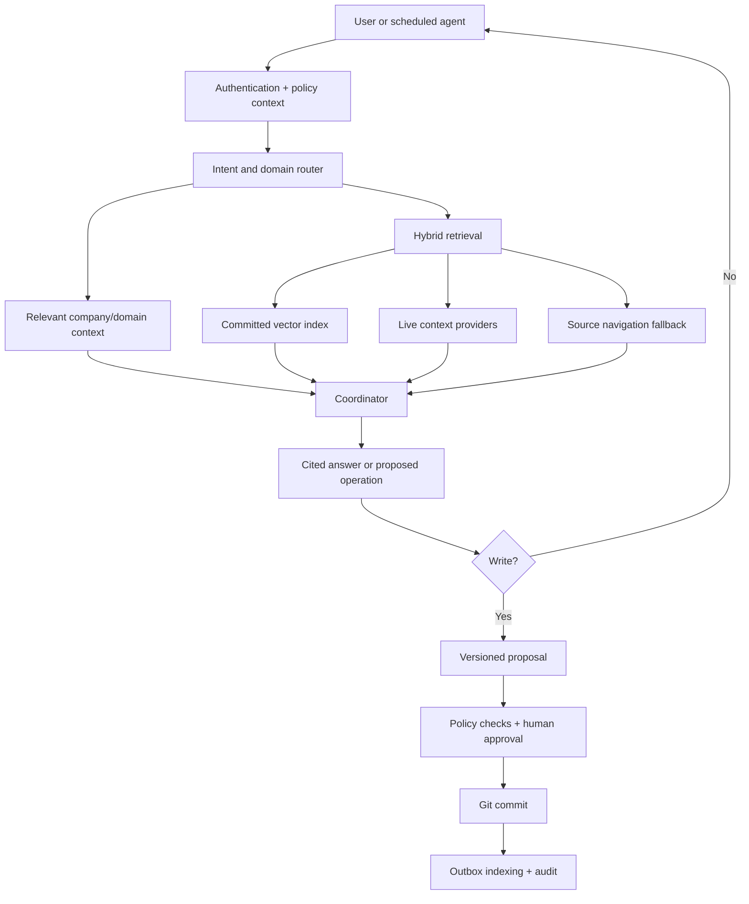

# Grasp Company Brain implementation plan

The work should be delivered in dependency order. Writable memory, autonomous agents, and self-improvement must not be enabled until consistency, authorization, evaluation, and rollback are reliable.

## 1. Target architecture



Core rules:

- Only approved, committed knowledge is searchable.
- Every request carries an authenticated user and permission context.
- Context is selected dynamically, never injected wholesale.
- Agents propose changes; execution is controlled separately.
- Derived indexes can always be rebuilt from committed source data.
- Existing connectors and APIs remain available through adapters during migration.

---

# Phase 0 — Baseline, architecture boundaries, and quality gates

## 0.1 Record the current baseline

Measure before changing behavior:

- Query latency: p50, p95, time to first streamed token.
- Retrieval latency and result relevance.
- Connector sync duration and failure rate.
- Indexing throughput and failure rate.
- Average prompt size, model calls, and token cost.
- Citation correctness.
- Current answer-quality evaluation set.
- Memory, CPU, PostgreSQL, and Chroma usage.

Create representative test corpora containing:

- Conflicting documents.
- Stale and current documents.
- Documents with identical titles.
- Restricted documents.
- Prompt-injection content.
- Large Slack threads and documents.
- Connector failures and rate limits.

## 0.2 Establish clean architectural boundaries

Avoid rewriting the application at once. Place interfaces around existing classes:

- `KnowledgeRepository` around `RepoManager`.
- `SearchIndex` around `VectorStore`.
- `ContextProvider` around existing connectors.
- `ChangeSetStore`.
- `PolicyEngine`.
- `JobQueue`.
- `AuditStore`.

The current composition root in [main.py](C:/Users/Asmeet/Desktop/grasp/main.py:140) should remain responsible only for constructing dependencies.

## 0.3 Add engineering gates

Introduce:

- Alembic database migrations.
- Ruff formatting and linting.
- Mypy or Pyright strict checks for new modules.
- Pytest unit, integration, security, and connector-contract tests.
- Coverage thresholds for critical policy and change-management code.
- Dependency and secret scanning.
- CI checks for migrations, tests, linting, and evaluations.

Exit gate: existing behavior is covered by tests and performance baselines without feature changes.

---

# Phase 1 — Fix existing security and correctness issues

## 1.1 Enforce authentication

The current query endpoint is public in [server.py](C:/Users/Asmeet/Desktop/grasp/src/api/server.py:333). Require an approved user for:

- `/api/query`
- `/api/sources`
- Contribution submission, listing, and download
- Chat access
- Any future memory or agent endpoint

Keep a separate unauthenticated liveness endpoint for Docker health checks.

Update the browser client to attach authentication to queries. Replace identity-by-name and the readable `grasp_user` cookie with user IDs derived from authenticated sessions.

## 1.2 Introduce real authorization

Current organization titles are not security roles. Separate:

- `job_title`: Associate, Manager, Partner, etc.
- `system_role`: member, knowledge_editor, operator, administrator.
- `permissions`: query, contribute, review, manage users, manage agents.
- Source and document access rules.

Every retrieval operation must apply access filters before content reaches the model.

## 1.3 Harden browser and API security

- Replace wildcard CORS with configured trusted origins.
- Prefer secure, HTTP-only, same-site session cookies or a short-lived access/refresh-token design.
- Add CSRF protection if cookies are used.
- Rate-limit authentication, queries, and uploads.
- Apply upload size, page-count, and extracted-text limits.
- Sanitize rendered Markdown and uploaded filenames.
- Use constant-time comparison for any remaining bootstrap admin key.
- Redact secrets and sensitive content from logs.
- Make the admin key a bootstrap mechanism, not the permanent admin session.

## 1.4 Add migrations and relational integrity

Add foreign keys and indexes for existing tables:

- Chat threads → users.
- Contributions → submitter user and reviewer.
- Unique Google identity.
- Indexed status, timestamps, and ownership columns.

Add an `organizations` table and a default organization migration, even if Grasp initially remains single-company.

Exit gate: automated tests prove that unauthenticated and unauthorized users cannot query, enumerate, or download company content.

---

# Phase 2 — Make Git approval and indexing consistent

This is the highest-priority data change.

The current sync path writes files and immediately indexes them in [orchestrator.py](C:/Users/Asmeet/Desktop/grasp/src/sync/orchestrator.py:307). Rejecting the Git changes therefore leaves rejected content in Chroma. Contribution approval has the inverse problem: it writes repository files but does not index them.

## 2.1 Introduce immutable change sets

Create a `knowledge_changesets` table:

- ID and type: sync, contribution, memory, context, self-improvement.
- Creator and organization.
- Base Git commit.
- State: draft, awaiting_review, approved, applying, active, rejected, failed.
- Proposed file operations.
- Provenance and source references.
- Reviewer, review time, and explanation.
- Final commit SHA.
- Error and retry state.

Each change set should use an isolated staging directory or Git worktree. Stop placing all proposals into one shared working tree.

## 2.2 Use one write path

All knowledge changes must use:

```text
Normalize → validate → stage → review → commit → index → activate
```

This applies to:

- Connector synchronization.
- User contributions.
- Conversation-derived memories.
- Canonical context changes.
- Self-improvement proposals.

No component should call `RepoManager.write_document()` or Chroma directly outside this pipeline.

## 2.3 Add an outbox-driven activation process

Git, PostgreSQL, and Chroma cannot share one transaction. Use an idempotent saga:

1. Lock the change set.
2. Validate that its base commit is current.
3. Create the Git commit.
4. Record the commit SHA and indexing job in one PostgreSQL transaction.
5. Index the committed content.
6. Verify chunk counts and hashes.
7. Activate the revision.
8. Leave the previous searchable revision active if indexing fails.

A startup reconciler should repair interrupted states by comparing database records, commit metadata, and index manifests.

## 2.4 Make indexes derived and rebuildable

- Generate `_index/*.json` from committed Markdown instead of incrementally modifying shared JSON files.
- Store content hashes and commit SHAs in vector metadata.
- Propagate deletions to Chroma using tombstones.
- Make indexing failures visible; do not swallow them as `VectorStore.index_document()` currently does.
- Support blue/green full-index rebuilds and an atomic active-index pointer.
- Record the embedding model and index schema version.

## 2.5 Handle conflicts

When the repository advances after a proposal was created:

- Rebase or replay the file operations.
- Detect semantic and text conflicts.
- Return conflicts to the reviewer.
- Never silently overwrite newer context.

Exit gate: rejected content never appears in search, approved contributions always appear, interrupted activation can be retried safely, and the index can be rebuilt from Git.

---

# Phase 3 — Reliable and non-blocking synchronization

## 3.1 Define a richer ingestion model

Replace raw `Document` handoffs with an immutable ingestion candidate containing:

- Stable source and external IDs.
- Content hash.
- Source revision or ETag.
- Created and updated timestamps.
- ACL principals.
- Domain and sensitivity hints.
- Provenance URL.
- Deletion/tombstone status.
- Connector cursor.

Retain a compatibility adapter for the existing `Document` type in [base.py](C:/Users/Asmeet/Desktop/grasp/src/connectors/base.py:21).

## 3.2 Fix incremental-sync gaps

The next sync must resume from the previous sync’s start watermark or provider cursor, not its completion time. Otherwise, updates made during a long sync can be missed.

Also add:

- Overlap windows with hash-based deduplication.
- Deletion detection.
- Cursor validation.
- Per-connector retry queues.
- Dead-letter records for repeatedly failing documents.
- Idempotent document processing.

## 3.3 Move background work outside the web request path

Introduce a worker process for:

- Synchronization.
- Classification.
- Indexing.
- Scheduled agents.
- Evaluations.

Use PostgreSQL-backed jobs initially to avoid another infrastructure dependency. Protect scheduled jobs with PostgreSQL advisory locks so multiple replicas cannot execute the same routine.

Run blocking Git, filesystem, document parsing, and Chroma operations in bounded worker threads or processes rather than on the FastAPI event loop.

## 3.4 Improve connector concurrency

- Replace the global per-connector request lock with bounded semaphores and rate-aware token buckets.
- Add circuit breakers.
- Use connector-specific retry policies.
- Add strict overall deadlines.
- Cache health checks and source metadata.
- Record rate-limit and timeout metrics.

Exit gate: sync activity does not materially degrade chat latency, and repeated or concurrent jobs cannot duplicate changes.

---

# Phase 4 — Canonical context and governed organizational memory

## 4.1 Add canonical context

Extend the repository without moving existing content:

```text
company/
  CONTEXT.md
  terminology.md
  policies/
domains/
  product/CONTEXT.md
  sales/CONTEXT.md
  marketing/CONTEXT.md
  customer-success/CONTEXT.md
  finance/CONTEXT.md
  hr/CONTEXT.md
  legal/CONTEXT.md
  compliance/CONTEXT.md
agents/
```

Existing `decisions`, `projects`, `people`, and other knowledge types remain. Add `domain` as an orthogonal metadata field instead of replacing the current taxonomy.

## 4.2 Build a context router

Before calling the coordinator:

1. Classify the request’s intent and domains.
2. Load a small canonical-company summary.
3. Load only relevant domain context.
4. Retrieve relevant evidence.
5. Enforce a configurable token budget.
6. Resolve conflicting instructions by scope and precedence.

Precedence should be:

```text
Security policy → company policy → domain context → user request
```

## 4.3 Add structured memory

Use governed relational models rather than unrestricted agentic SQL:

- Entities: people, customers, projects, products, teams.
- Aliases and deduplication keys.
- Relationships.
- Commitments and follow-ups.
- Evidence links.
- Confidence and freshness.
- Sensitivity and ACL.
- Valid-from and valid-to timestamps.

The agent queries this through typed services. It must not create arbitrary tables or execute unrestricted SQL.

## 4.4 Add conversational memory proposals

After a conversation, Grasp may extract proposed:

- Facts.
- Decisions.
- Commitments.
- Entity updates.
- Wiki pages.

Each proposal must include evidence and confidence and enter the same change-set review flow. Chat history itself must never automatically become company truth.

Exit gate: context improves the evaluation set without increasing average prompt size beyond the configured budget.

---

# Phase 5 — Context providers and hybrid retrieval

## 5.1 Create a capability-based provider interface

Each provider advertises supported capabilities:

- Search.
- Browse/navigate.
- Read.
- Propose write.
- ACL discovery.
- Incremental sync.

Adapt existing Confluence, Jira, SharePoint, Slack, and Notion connectors to this interface without initially changing their behavior.

## 5.2 Add selective tool routing

Do not expose every provider to the coordinator.

A lightweight router should select:

- Relevant domains.
- Up to a configured number of providers.
- The smallest applicable tool set.
- Local retrieval before expensive live navigation.

This replaces unconditional live fan-out for questions that the committed knowledge store can answer.

## 5.3 Preserve hybrid retrieval

Use this order:

1. Structured memory lookup.
2. Lexical and vector retrieval from committed content.
3. Reranking and deduplication.
4. Full-document reads.
5. Live source navigation when freshness or missing context requires it.
6. External web research only when explicitly relevant.

Navigation should supplement—not replace—Grasp’s existing fast retrieval.

## 5.4 Add Scout-style providers safely

Add independently feature-flagged providers:

- Google Drive.
- Read-only MCP servers.
- Web research.
- Workspace/code repository.
- Company voice/style context.

Requirements:

- ACL enforcement before model access.
- Source-specific timeouts and budgets.
- Prompt-injection isolation.
- External web evidence clearly separated from internal truth.
- No automatic persistence of web content.
- MCP allowlists, scoped credentials, and response validation.

Exit gate: relevant-source selection reduces average provider calls and latency while maintaining or improving retrieval recall.

---

# Phase 6 — Evidence-backed work planning

## 6.1 Add evidence-backed work planning

Create `work_items` for tasks and follow-ups with:

- Evidence and source.
- Owner.
- Due date.
- Confidence.
- Status.
- Deduplication key.
- Originating agent or user.

Low-confidence suggestions remain proposals and do not become assigned work automatically.

Exit gate: work-item tests prove ownership, deduplication, and status transitions.

---

# Phase 7 — Role agents, routines, and Slack interface

## 7.1 Define agents declaratively

Each agent definition contains:

- Role and owner.
- Assigned domains and analysis skills.
- Allowed data classifications.
- Approval thresholds.
- Schedule or event triggers.
- Runtime and cost budget.
- Concurrency limits.
- Escalation path.

Agents use the same coordinator, provider, and policy services as interactive chat; they must not introduce parallel implementations.

## 7.2 Add safe routine execution

- Persist every run and state transition.
- Use leases and idempotency.
- Prevent two agents from owning the same task.
- Suppress unchanged reports.
- Apply daily cost limits.
- Pause agents automatically after repeated failures.
- Provide a global emergency stop.

## 7.3 Add Slack as another client

Slack should call the same authenticated query APIs as the browser.

Implement:

- Slack-to-Grasp identity mapping.
- Channel and thread ACL validation.
- Private response handling.
- Mention/event deduplication.
- Request-signature verification.
- Rate limiting.

Exit gate: scheduled and Slack requests produce the same permission decisions and answer quality as browser requests.

---

# Phase 8 — Controlled self-improvement

Implement this last.

## 8.1 Capture feedback safely

For eligible query executions, retain:

- Original request.
- Context version.
- Draft output.
- User-approved output.
- Structured edit diff.
- Approval identity.

## 8.2 Generate improvement proposals

The improvement process may propose:

- A context correction.
- A better example.
- A validation check.

It may not directly modify active context.

## 8.3 Gate every improvement

A proposed improvement must:

1. Pass schema and policy validation.
2. Pass the existing behavior’s regression tests.
3. Pass permission and prompt-injection tests.
4. Improve the targeted evaluation.
5. Avoid degrading the wider evaluation suite.
6. Receive human approval.
7. Run as a canary before full activation.

Limit rule growth and periodically consolidate redundant instructions.

Exit gate: every learning change is attributable, evaluated, approved, versioned, and reversible.

---

# Phase 9 — Observability, administration, and rollout

Add administrative views for:

- Change-set review and conflicts.
- Index activation and lag.
- Context and memory proposals.
- Entity merges.
- Provider permissions and health.
- Agent schedules and runs.
- Audit events.
- Evaluation history.
- Cost, latency, and token metrics.

Trace data must redact credentials, private content, and unnecessary personal data.

## Rollout strategy

Every major capability gets an independent flag:

- `AUTH_REQUIRED`
- `REVISIONED_KNOWLEDGE`
- `CONTEXT_ROUTING`
- `STRUCTURED_MEMORY`
- `PROVIDER_ROUTING`
- `AGENTS_ENABLED`
- `SELF_IMPROVEMENT_ENABLED`

Roll out using:

1. Shadow mode.
2. Internal administrators.
3. Selected teams.
4. Read-only general availability.
5. Approved writes.
6. Limited autonomous routines.

Rollback means disabling the flag and restoring the previous active Git/index versions—not manually repairing data.

---

# Conflict-prevention decisions

| Potential conflict | Resolution |
|---|---|
| Git approval vs. Chroma indexing | Index committed revisions only |
| Existing knowledge types vs. business domains | Keep both as orthogonal metadata |
| Existing connectors vs. new providers | Wrap connectors with adapters |
| Vector retrieval vs. navigation | Hybrid routing; navigation is a fallback |
| Chat history vs. company memory | Persist only reviewed memory proposals |
| Job titles vs. security roles | Store them separately |
| Multiple replicas vs. scheduler | Persistent jobs plus advisory locks |
| Multiple agents vs. task ownership | Leases, ownership, and idempotency |
| Self-improvement vs. reliability | Evaluation and review before activation |
| Source service accounts vs. user ACLs | Propagate source ACLs and default-deny unknown access |
| Web research vs. internal truth | Separate evidence classes; never auto-persist web results |

# Performance and quality acceptance targets

Initial targets should be finalized after Phase 0 measurements:

- No unauthorized document returned in automated ACL tests.
- No rejected revision visible in retrieval.
- Local retrieval p95 no worse than the current baseline.
- Common queries avoid live provider calls when committed evidence is sufficient.
- Query time-to-first-token improves for local-answer questions.
- Sync and indexing do not block interactive request handling.
- Context stays inside an explicit token budget.
- Citation precision and retrieval recall do not regress.
- Every new feature passes deterministic tests and the behavioral evaluation suite.
- Failed changes, index jobs, and agents are retryable without manual data repair.

No implementation or file changes were made.
