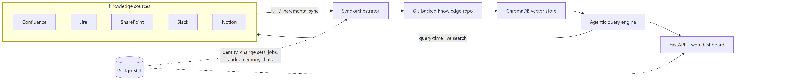

<p align="center">
  
</p>
<p align="center">
  <b>Agentic AI company brain</b> — retrieves, indexes, and reasons over company knowledge from Confluence, Jira, SharePoint, Slack, and Notion.
</p>


---

Grasp is a self-hosted knowledge platform that continuously collects your organization's knowledge from the tools your teams already use, stores it in a version-controlled Markdown repository, and answers natural-language questions with cited, evidence-grounded responses.

Every write to the knowledge base goes through a human-reviewed change set — no AI edit lands in your company brain without approval.

## Features

- **Multi-platform ingestion** — first-class connectors for Confluence, Jira, SharePoint, Slack, and Notion, with full, incremental, and query-time live search modes.
- **Git-backed knowledge repository** — a three-layer layout of raw `sources/`, curated `knowledge/`, and team-scoped spaces, plus auto-generated index files (graph, tags, freshness, experts).
- **Semantic search** — ChromaDB vector store with OpenAI embeddings, markdown-aware chunking, metadata filters, and ACL filtering before any content reaches the model.
- **Agentic Q&A** — a coordinator agent fans out queries in parallel to every source, shortens queries for live platform APIs, calls tools for follow-ups, and streams answers with citations via SSE.
- **Governed write path** — immutable change sets, diff review, approve/reject, Git commit, and remote push.
- **User contributions** — team members can submit documents, code, or plain text; admins review and approve before content is ingested.
- **Structured organizational memory** — an entity/relationship graph of people, teams, projects, and products, with review, merge, and work-item workflows.
- **Scheduled company-brain agents** — declaratively configured agents that produce knowledge briefs, gap analyses, risk watches, and decision digests.
- **Enterprise controls** — email + Google sign-in, role-based access control, document-level ACLs, append-only audit log, rate limiting, and observability metrics.

## Architecture



PostgreSQL is the system of record for identity, policy, review state, jobs, audit history, and active revision pointers. Git is the source of truth for knowledge content, and Chroma is a rebuildable derived index.

## Quick start

### Prerequisites

- Python 3.11+
- PostgreSQL 16 (or Docker)
- Git
- API credentials for at least one LLM provider and one knowledge source

### 1. Configure environment

Copy the template and fill in your credentials:

```bash
cp .env.example .env
```

At minimum you need an LLM key (`ANTHROPIC_API_KEY` or `DEEPSEEK_API_KEY`), an OpenAI embeddings key, one connector's credentials, and an `ADMIN_KEY`.

> [!NOTE]
> If `OPENAI_API_KEY` is not set, Grasp falls back to ChromaDB's default embedding model so you can still evaluate the system locally.

### 2. Start PostgreSQL

```bash
docker compose up -d db
```

The default `DATABASE_URL` in `.env.example` matches the credentials used by the Docker Compose Postgres service.

### 3. Install and run

```bash
python -m venv .venv
source .venv/bin/activate   # Windows: .venv\Scripts\activate
pip install -e ".[dev]"
python main.py
```

Open [http://localhost:8000](http://localhost:8000).

### 4. First-run bootstrap

1. Register an account from the login page.
2. Claim administrator access using the bootstrap flow with your `ADMIN_KEY` (`X-Admin-Key` header).
3. Approve any pending user registrations.
4. Trigger an initial sync from the admin dashboard.
5. Review the generated change set, then approve it to commit and index the knowledge.

> [!IMPORTANT]
> Grasp is deliberately read-only by default: agents and scheduled jobs can query, but every knowledge write is staged as a change set and requires human approval.

## Configuration

All settings are loaded from environment variables or `.env` via Pydantic. Key variables:

| Variable | Purpose |
| --- | --- |
| `LLM_PROVIDER` | `anthropic` or `deepseek` |
| `ANTHROPIC_API_KEY` / `DEEPSEEK_API_KEY` | Provider key for the configured LLM |
| `AGENT_MODEL`, `CLASSIFIER_MODEL`, `QUERY_SHORTENER_MODEL` | Models used for reasoning, classification, and query decomposition |
| `OPENAI_API_KEY`, `EMBEDDING_MODEL` | Embeddings for the vector index |
| `GITHUB_REPO_PATH`, `GITHUB_REMOTE_URL`, `GITHUB_PAT` | Local and remote knowledge repository |
| `CONFLUENCE_URL`, `CONFLUENCE_EMAIL`, `CONFLUENCE_API_TOKEN` | Confluence Cloud credentials |
| `JIRA_URL`, `JIRA_EMAIL`, `JIRA_API_TOKEN` | Jira Cloud credentials |
| `SHAREPOINT_TENANT_ID`, `SHAREPOINT_CLIENT_ID`, `SHAREPOINT_CLIENT_SECRET`, `SHAREPOINT_SITE_ID` | Microsoft Graph app credentials |
| `SLACK_BOT_TOKEN` | Slack bot token |
| `NOTION_API_KEY` | Notion integration key |
| `SYNC_CRON_HOURS`, `SYNC_CRON_MINUTE`, `SYNC_BATCH_SIZE` | Sync schedule (UTC) and batch size |
| `ADMIN_KEY` | Secret for admin endpoints and bootstrap |
| `GOOGLE_CLIENT_ID`, `SESSION_SECRET`, `TRUSTED_ORIGINS` | Auth and CORS settings |
| `AUTH_REQUIRED`, `REVISIONED_KNOWLEDGE`, `STRUCTURED_MEMORY`, `AGENTS_ENABLED` | Feature and rollout flags |
| `DATABASE_URL` | PostgreSQL connection URL |

See [.env.example](.env.example) for the complete list with defaults and comments.

## Docker deployment

```bash
docker compose up -d --build
```

This starts the app and PostgreSQL, mounts persistent volumes for the knowledge repository, Chroma data, and Grasp's internal state, and configures health checks for both services. Ensure `.env` is complete before starting.

## Project structure

```text
main.py                  Application entry point and dependency wiring
src/
  api/                   FastAPI server, request models, rate limiting
  agent/                 Query engine, tool definitions, sub-agents, query shortener
  connectors/            Confluence, Jira, SharePoint, Slack, and Notion connectors
  sync/                  Sync orchestrator, scheduler, checkpoints
  index/                 ChromaDB vector store
  repo/                  Git-backed knowledge repository manager
  core/                  Interfaces, change invariants, policy engine
  memory.py              Structured organizational memory
  changesets.py          Reviewable knowledge change sets
  contributions.py       User-submitted content workflow
  jobs.py                Durable PostgreSQL job queue
  auth.py                Users, sessions, and role management
  agents.py              Governed, scheduled company-brain agents
  observability.py       Metrics and log redaction
  static/                Web dashboard (HTML/CSS/JS)
tests/                   pytest suite
knowledge_repo/          Generated knowledge repository (gitignored)
```

## API overview

| Group | Routes | Purpose |
| --- | --- | --- |
| Auth | `/api/auth/*` | Register, login (email/Google), profile, password, account deletion |
| Admin | `/api/admin/*` | Bootstrap, user approval, roles, metrics, audit events, observability |
| Query | `/api/query` | Streamed agentic Q&A over the knowledge base |
| Sync | `/api/sync/*` | Trigger, status, and history of knowledge syncs |
| Changes | `/api/changes/*` | Pending change sets, diffs, approve/reject |
| Sources | `/api/sources` | Connected sources and sync stats |
| Agents | `/api/agents/*` | Agent definitions, scheduling, runs, emergency stop |
| Contributions | `/api/contributions/*` | Submit/upload content and review pending contributions |
| Memory | `/api/memory/*` | Entities, relationships, graph, work items, stats |
| Chats | `/api/chats` | Saved chat threads |
| Health | `/api/health/live`, `/api/status` | Liveness and system status |

Interactive API documentation is available from FastAPI at `/docs`.

## Development

```bash
pytest                       # Run the test suite
ruff check .                 # Lint
ruff format --check .        # Format check
mypy                         # Type check (src/core, src/ingestion)
bandit -q -r src -x src/connectors   # Security scan
```

A GitHub Actions workflow is included at [.github/workflows/ci.yml](.github/workflows/ci.yml) with a PostgreSQL service container for quality checks.
